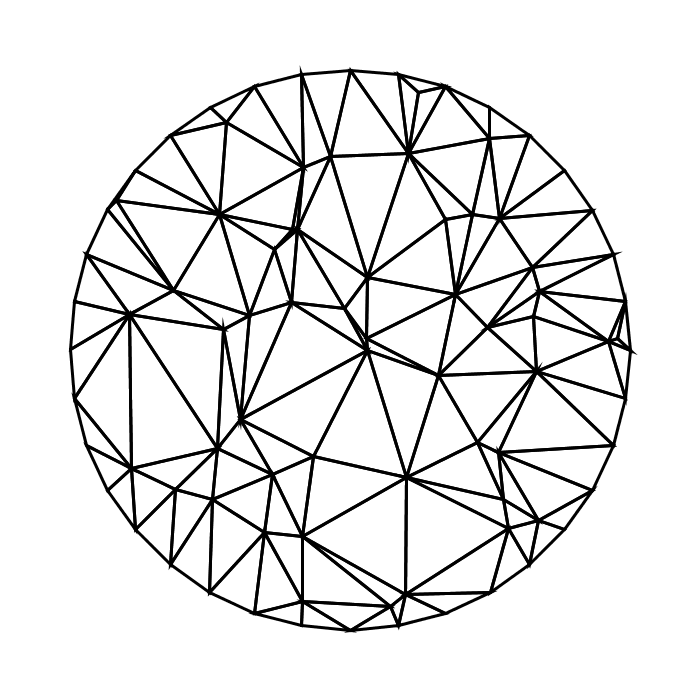
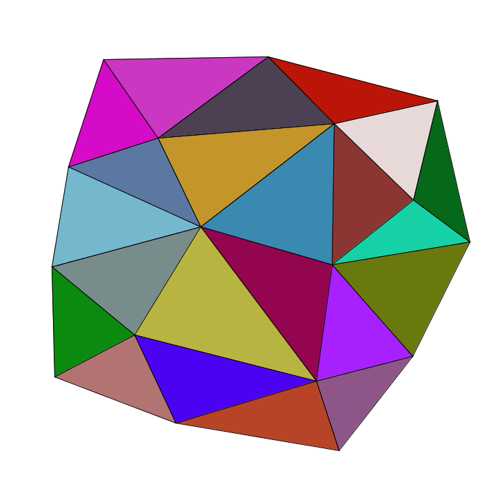
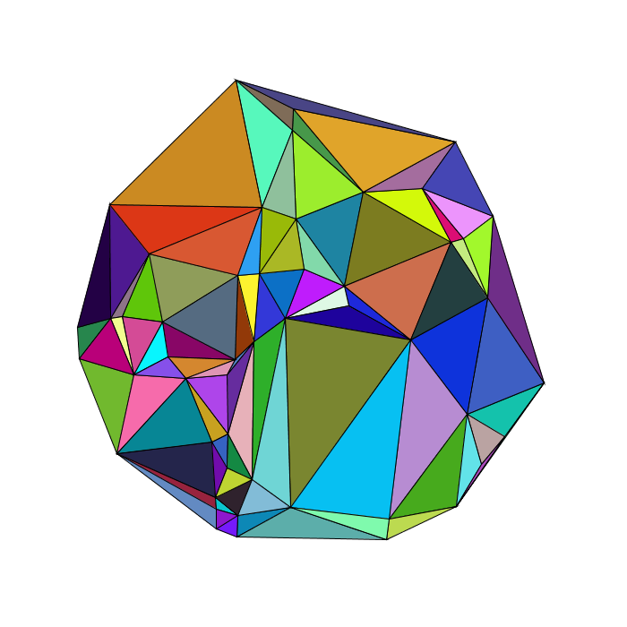

# Delaunay
Triangulation de Delaunay

## Comment l'ouvrir et le lancer :
-Télécharger Processing 3 : https://processing.org/download/
-Ouvrir et lancer "" avec Processing 3

## Utilisation :
Clic gauche : Distribution aléatoire
Clic droit : ajoute un point sur la position de la souris
Molette : Change la méthode d'affichage

